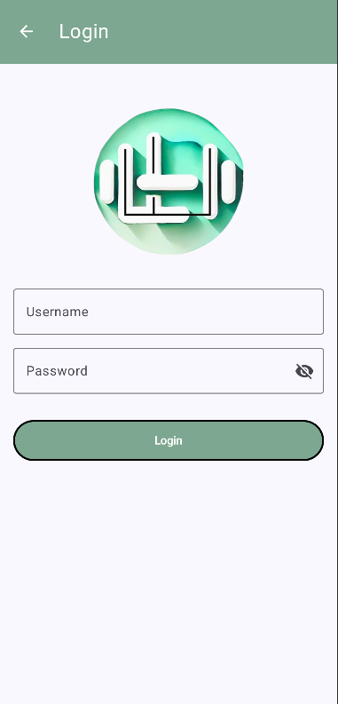

# LightWeight
LightWeight, a one-stop app for nutrition education and exercise expertise.

# Overview
Problem: College students often struggle to maintain a healthy lifestyle due to limited time, tight budgets, and a lack of accessible fitness and nutrition resources. This leads to challenges in balancing academic performance with physical and mental well-being.  
Enter LightWeight, a new fitness mobile application, developed by college students, for college students, to help them optimize their bodies and minds through fitness, exercise routines, nutrition recommendations, and weight tracking in an easy-to-use platform. We understand college students have limited time, and tight budgets so we bring this knowledge and tools to empower them in their academic life. A one-stop app for nutrition education and exercise expertise.

# Features
Login/Sign-Up Page: Create a new account or log in to access your personalized exercise and nutrition details.  
Home Page: Navigate towards the nutrition page, exercise page, or weight page while also viewing your Weight Progress  
Weight Tracker Page: Input your weight and date in orer for your weight to be tracked on the Home Page   
Exercise Page: Select a muscle group to view a list of excercises that utilize that muscle group   
Nutrition Page: Input the food you've eaten for nutritional information such as calories to appear   

# Competition
  
LightWeight offers a financially responsible solution for college students looking to improve their fitness  
Other apps require a subscription for ad-free fitness  

# Screens
Main screen with weight graph  
   
Weight tracking and updating screen 
 
Sidebar (present throughout app)  
 
Muscle groups on exercise screen 
 
Exercises on exercise screen 
 
Nutrition screen 
 
Register screen  
 
Login screen  
 

# Transition Diagram
Utilizing the sidebar, one can navigate anywhere from any screen as well!  
  

# Prototype
  

# Tips
You can change your profile picture by clicking the picture at the top right of your homescreen and putting the link to an image there. It will be saved to your account!  

# Feedback-based Improvements
Based on feedback from 5 users, the critiques we sorted out are as follows:  
Sorted exercises by muscle group by adding a menu  
Added the ability to change profile pictures  
Added a graph to track weight changes for convenience and visual appeal  
Allowed for the usage of dark-mode as a theme for the app  
Display calorie intake on nutrition screen in terms of daily percentage, according to intake goals.  

# Future Improvements
Additional improvements to be added based on critique:  
The ability to favorite specific exercises so that a user can create a custom exercise plan/rotation for themselves 
The ability to take pictures of food to submit on the nutrition screen 
The ability to create personalized meal plans for health goals 
Add wearable functionality 

# Credits
Osmany: Project Manager, Software Engineer, UI Designer. Handled API research and implementation while leading every screen.  
Salar: Software Engineer, UI Designer. Designed the Muscle Group and Exercise Screens.  
Meraj: Software Engineer, UI Designer. Designed the Registration Screen while adding details to the Nutrition Screen.  
Francis: Database Engineer, Software Engineer, UI Designer. Handled all database uploads such as profile picture, registration information, and main screen weight graph.  
Bryant: Software Engineer, UI Designer. Designed the Nutrition Screen and the Login Screen.  
